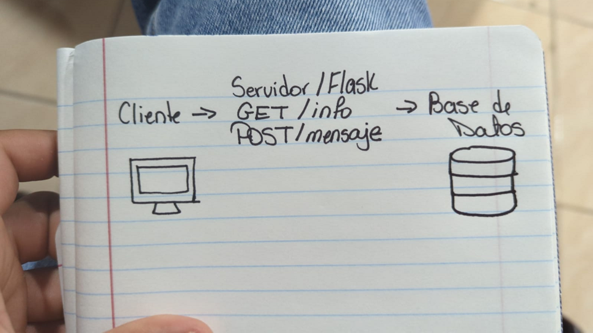

en esta asignatura se crea un servidor flask con dos rutas get y post.

el diagrama es el cliente solicitando get/info y post/mensaje lo cual llega al servidor flask y el que se comunica con la base de datos y responde a la solicitud.
